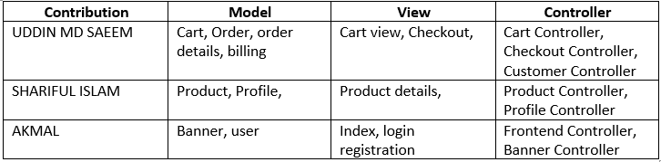

# Food4u

Group Name: Al Ma'rifah

Group Members:
- MD SAEEM UDDIN 1721129
- MR SHARIFUL ISLAM 1619061
- MUHAMAD AKMAL BIN ABU BAKAR 1811543

**INTRODUCTION**

As a project of our courses INFO 3305 for semester 1 2020/2021, We discuss among ourselves and decide to make an application that will provide a good service to the users. We are going to make an application to order food in advance and users can choose to dine in later or we will deliver it to their footsteps. 
The application name will be Food4U. This application is going to benefits most people especially during this pandemic when most of people are stayed at home. The application will provide a variety of food category to meet the tastes of various people. We also will be placed food which is in promotion to the front page as a marketing strategy.

**OBJECTIVES**

The general objectives of this web application are to develop a reliable, convenient and giving a positive impact to the public. Our goals are as stated below.
- Provide an application that gives satisfaction to the customer
- Design an application that will please the user of the application
- To improve communication between buyers and seller and minimize the time of ordering
- To calculate the bill, receipt amount automatically and accurately

**FEATURES AND FUNCTIONALITIES**

This website application will ease a person everyday life. They can order the food without need to be physically on the store or restaurant. Furthermore, during this pandemic of COVID-19, the risk of infected could be lessen since we could avoid any gathering. This website also can provide an information on store as well as avoid any mistake since the price are calculated automatically and accurately.

 **DIAGRAM**
 
ER_Diagram

The diagram above can be seen that we use controller to accept input from the customer class which allows the user to input their name, address, and phone number. Once the details are retrieved, it will convert its command to the model to insert the customers data into the system database. Then the menu will be displayed by using view. The user will once again choose the food and the quantity of the products and the model will receive their input and will be sent onto databases.

Once all the data are received, the system will calculate the total price of the food of the customer ordered. It will then display the total amount of customer need to pay. The controller will take part of the process and view system will display back to the customer. The system will process the payment and display their receipt and order ID to track their order status. Once the order has been completed, it will delete the data in database system.

**Sequance Diagram**

**Work Delegation**

 
 

 **REFRENCES**
   - Controllers. (n.d.). Laravel - The PHP Framework For Web Artisans. https://laravel.com/docs/8.x/controllers
   - Eloquent: Getting started. (n.d.). Laravel - The PHP Framework For Web Artisans. https://laravel.com/docs/8.x/eloquent
   - (n.d.). KFC Malaysia | Now available for Delivery and Self Collect!. https://kfc.com.my
   - Views. (n.d.). Laravel - The PHP Framework For Web Artisans. https://laravel.com/docs/8.x/views
   
   
   
   
   **PROJECT CODES**
   https://drive.google.com/drive/folders/1p0UraToVWCyAT2myYN11nJONDHhvexK2?usp=sharing
